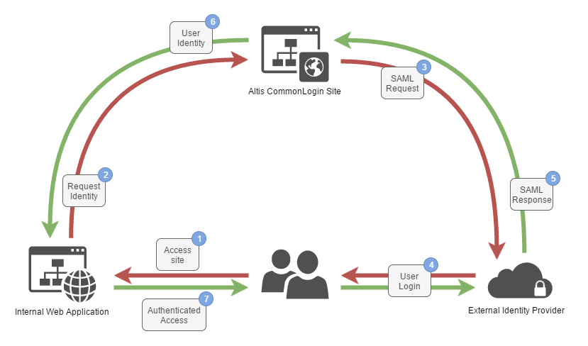

# Altis.CommonLogin

----------

- [Process Overview](#process-overview)
- [Usage](#usage)
	- [Prerequisites](#prerequisites)
	- [Integration Steps](#integration-steps)
- [Project Structure](#project-structure)
	- [Altis.CommonLogin.Owin](#altiscommonloginowin)
	- [Altis.CommonLogin.Web](#altiscommonloginweb)
	- [Altis.CommonLogin.TestSite.Web](#altiscommonlogintestsiteweb)
- [Configuration](#configuration)
	- [Altis.CommonLogin.Web](#altiscommonloginweb-1)
	- [Altis.CommonLogin.TestSite.Web](#altiscommonlogintestsiteweb-1)
	- [Machine Key](#machine-key)
- [Claims Customisation](#claims-customisation)

----------

Altis.CommonLogin is an OWIN authentication middleware for use in ASP.NET websites. It is intended for use with multiple websites operating on the same domain, where you want to have one common authentication system managing access to all sites.

The Altis.CommonLogin.Web project handles federation with a third-party SAML Identity Provider and can be used to provide authentication to any number of websites hosted on the same domain or at different subdomains. In this way you can authenticate once and gain access to all related sites.

Altis.CommonLogin.Web uses *Kentor Authentication Services* to manage SAML implementation and access. Please check out the project [here](https://github.com/KentorIT/authservices "Kentor Authentication Services") for more detailed information and many thanks to the team there for their excellent work!


## Process Overview
An overview of the Altis.CommonLogin process can be seen in the diagram below:



When an unauthenticated user navigates to an internal web application (IWA) the IWA will redirect the user to the Altis CommonLogin site. CommonLogin will then submit a SAML authentication request to the external identity provider. The user will then be prompted to authenticate against the external identity provider and a SAML response will be sent back to Altis CommonLogin. The SAML response will be processed and the user identity will be stored in an encrypted cookie, ready for use by the IWA. The user is returned to the IWA and their identity and access privileges are verified, enabling the user to accessed the content of the website.

The common login setup only really makes sense in a scenario where you have multiple IWAs. If an authenticated user accesses a second IWA, the IWA will be able to retrieve the users identity and access roles from the encrypted cookie and directly authenticate the user. If the user logs out of the common login system they are automatically logged out of all IWAs.


## Usage
In order to configure a web application to use Altis.CommonLogin there are a number of steps to follow and prerequisites that must be in place:

### Prerequisites
1. An external SAML 2 identity provider such as OneLogin, Octa, Centrify, LastPass, etc.
2. An internal .NET web application.

### Integration Steps
**Altis.CommonLogin.Web Configuration**

1. Set you external identity provider's certificate in the [IdentityProviderCertificate.cer](app/web/Altis.CommonLogin.Web/App_Data/IdentityProviderCertificate.cer) file.
2. If the internal web application is not located on the same server as the instance of Altis.CommonLogin.Web set a new machine key in the Web.config file.
3. Configure the required authentication settings in the Web.config file as detailed in the [configuration section](#altiscommonloginweb-1) below.
4. Perform any custom mapping of claims and roles (see [Claims Customisation](#claims-customisation)).

**Internal Web Application Configuration**

1. Install the [Altis.CommonLogin.Owin](https://www.nuget.org/packages/Altis.CommonLogin.Owin/) package from nuget.
2. If the internal web application is not located on the same server as the instance of Altis.CommonLogin.Web set a the same machine key as used for Altis.CommonLogin.Web in the Web.config file.
3. Configure the required authentication settings in the Web.config file as detailed in the [configuration section](#altiscommonlogintestsiteweb-1) below.

## Project Structure
The Altis.CommonLogin solution contains three projects: one library and two websites.

### Altis.CommonLogin.Owin
This is the core library which needs to be included in all websites implementing Altis.CommonLogin functionality. The library is an OWIN middleware and is specified as the OWIN startup class. For more details on OWIN see the following resources:

- [http://owin.org/](http://owin.org/)
- [https://docs.microsoft.com/en-us/aspnet/core/fundamentals/owin](https://docs.microsoft.com/en-us/aspnet/core/fundamentals/owin)

The [Authentication.cs](app/Altis.CommonLogin.Owin/Authentication.cs) class forms the core functionality of the library and specifies itself as the OwinStartup assembly, configures cookie authentication and applies user roles for the website through the [RoleClaimAttribute.cs](app/Altis.CommonLogin.Owin/RoleClaimAttribute.cs) class.

If you have other OWIN requirements you can override the default OWIN behaviour by specifying the appStartup in you Web.config file:

```
<configuration>
  <appSettings>
    <add key="owin:appStartup" value="MasterOwinStartup" />    
  </appSettings>
```

You can then instantiate Altis.CommonLogin along with any other OWIN middleware required:

```C#
using Altis.CommonLogin.Owin;
using Microsoft.Owin;
using Owin;

[assembly: OwinStartup("MasterOwinStartup", typeof(Altis.CommonLogin.TestSite.Web.Startup))]

namespace Altis.CommonLogin.TestSite.Web
{
    public class Startup
    {
        public void Configuration(IAppBuilder app)
        {
            Authentication.Configuration(app);
            app.MapSignalR();
        }
    }
}
```

### Altis.CommonLogin.Web
This is the central authentication website and handles the SAML authentication with the third-party identity provider.

Authentication configuration is handled in [Startup.cs](app/web/Altis.CommonLogin.Web/App_Start/Startup.cs), and is primarily achieved through settings in the Web.config file (see [the configuration section](#altiscommonloginweb-1) for more details).

The website exposes a number of endpoints. Of primary interest are the following:

- /Account/Login: This is the endpoint that authenticated sites will use to request user authentication.
- /AuthServices/Acs: This is the endpoint that third-party identity providers should send authentication responses to.

The project is configured to point to a stub identity provider for testing purposes. This is provided by Kentor at the following URL: [http://stubidp.kentor.se/](http://stubidp.kentor.se/).

### Altis.CommonLogin.TestSite.Web
This site is a complete example of a site which requires authentication from Altis.CommonLogin.Web. It contains no logic required for authentication, this being done solely through the inclusion of the Altis.CommonLogin.Owin library and configuration in the Web.config file.


## Configuration

### Altis.CommonLogin.Web
Web.config appSettings:

| Setting | Required | Description |
| --- | --- | --- |
| CommonLoginUrl | Yes | The URL of the Altis.CommonLogin.Web authentication site. |
| CookieDomain | Yes | The root domain that the sites are hosted on and that the authentication cookie will be stored for. |
| CookieExpiryHours| No | The number of hours that the authentication cookie is valid for. Defaults to 12 hours. |
| SingleSignOnIssuerUrl | Yes | External identity provider issuer URL. |
| SingleSignOnTargetUrl | Yes | External identity provider SAML 2.0 sign on endpoint. |
| SingleLogoutTargetUrl | No  | External identity provider single logout endpoint. |
| [IdP Role Claim Name]Roles | No | You can provide any number of identity provider roles parameters and give a comma separated list of the internal roles that they map to. These are role claims that may be provided by the external identity provider but not recognised by the internal websites. These are used in the Altis.CommonLogin.Web [AccountController.cs](app/web/Altis.CommonLogin.Web/Controllers/AccountController.cs) and the use can be adjusted within that class. |

In addition to the Web.config settings above, an identity provider certificate also needs to be specified. This is locates in the [IdentityProviderCertificate.cer](app/web/Altis.CommonLogin.Web/App_Data/IdentityProviderCertificate.cer) file.

### Altis.CommonLogin.TestSite.Web
Web.config appSettings:

| Setting | Required | Description |
| --- | --- | --- |
| AuthorisedRoles | If authorisation roles are enabled | A comma separated list of the internally specified roles that are able to access the website. |
| CommonLoginUrl | Yes | The URL of the Altis.CommonLogin.Web authentication site. |
| CookieDomain | Yes | The root domain that the sites are hosted on and that the authentication cookie will be stored for. |
| DisableAuthentication | No | Disable Altis.CommonLogin for the website (primarily useful for debugging in Visual Studio). |
| DisableAuthorisationRoles | No | Disable the use of internal authorisation roles. All authenticated users will be able to access the site. |

### Machine Key
If the internal web application is not located on the same server as the instance of Altis.CommonLogin.Web then a machine key will need to be specified in the Web.config files of both the internal web application and the Altis.CommonLogin.web sites. The projects contain a sample machine key, but it is important to change this to a unique and private key if it is required, to ensure the application remains secure. For details on how to generate machine keys check out [this ariticle](https://blogs.msdn.microsoft.com/amb/2012/07/31/easiest-way-to-generate-machinekey/).

## Claims Customisation
Beyond simple configuration of the application and your Identity provider, the most likely area of customisation will be in the processing of claims from the external identity provider and mapping these to claims on the internal identity. An example implementation taken from  [AccountController.cs](app/web/Altis.CommonLogin.Web/Controllers/AccountController.cs) can be seen below:

```C#
[AllowAnonymous]
public async Task<ActionResult> ExternalLoginCallback(string returnUrl)
{
    ...

    //Set name ID - we require a name ID to be provided as we use it as the anti-forgery claim type (see Altis.CommonLogin.Owin\Authentication.cs:line 84)
    var nameIdClaim = loginInfo.ExternalIdentity.Claims.Single(c => c.Type == ClaimTypes.NameIdentifier);
    identity.AddClaim(nameIdClaim);

    //Set name - fall back on the name ID if we don't have one
    var name = loginInfo.ExternalIdentity.Claims.SingleOrDefault(c => c.Type == "User.FirstName")?.Value ?? nameIdClaim.Value;
    identity.AddClaim(new Claim(ClaimTypes.Name, name));

    //Set all other claims, except role claims
    foreach (var claim in loginInfo.ExternalIdentity.Claims.Where(c => c.Type != ClaimTypes.Role))
    {
        if (identity.Claims.All(c => c.Type != claim.Type))
        {
            identity.AddClaim(claim);
        }
    }

    //Take the user's roles from the external identity provider and map them to the internal access roles that they apply to
    //For example, the external identity may provide a "FullAccess" role which gives access to all systems, or a "RestrictedAccess" role which only allows access to some
    foreach (var role in loginInfo.ExternalIdentity.Claims.Where(c => c.Type == ClaimTypes.Role).Select(c => c.Value))
    {
        var accessRoles = WebConfigurationManager.AppSettings[role + "Roles"];
        if (!string.IsNullOrEmpty(accessRoles))
        {
            accessRoles.Split(',').ToList().ForEach(r => identity.AddClaim(new Claim(ClaimTypes.Role, r)));
        }
    }

    ...
}
```

Here we assert that certain claims must be present, set the claims on the internal identity and setup our roles that the user has access to.